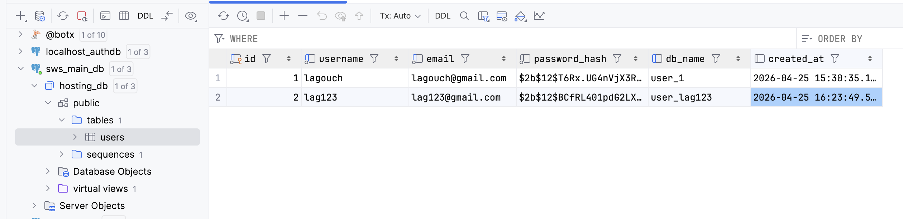
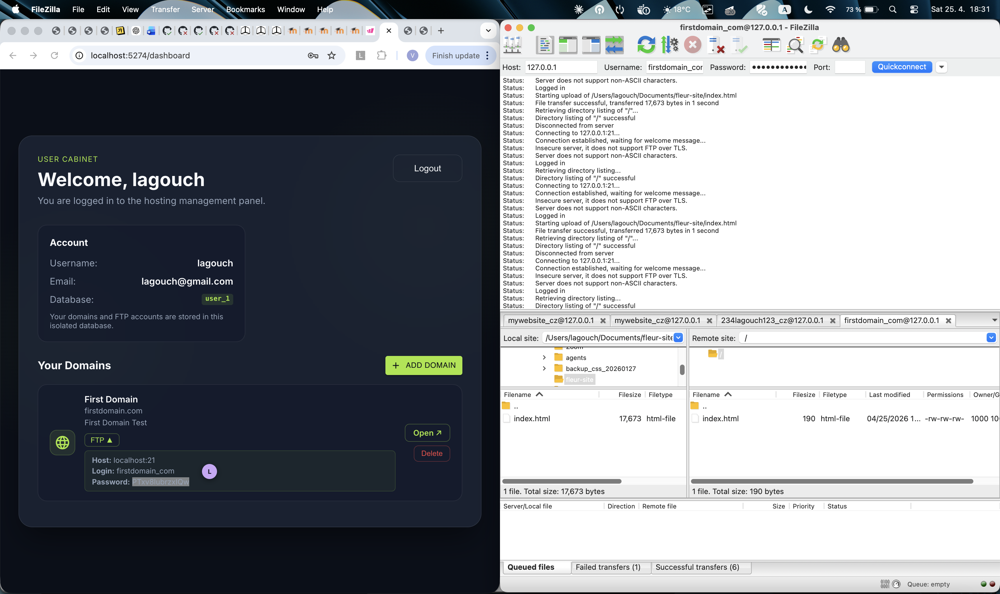
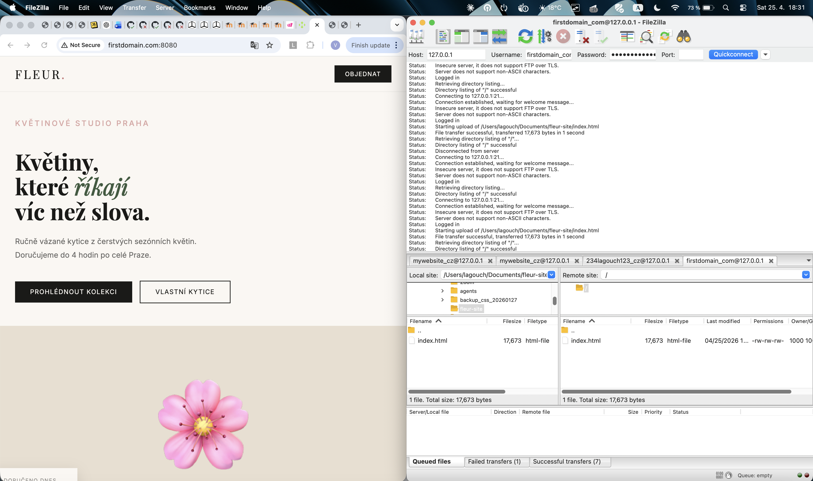
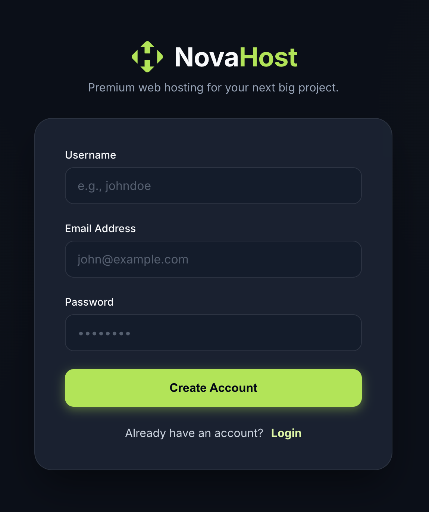
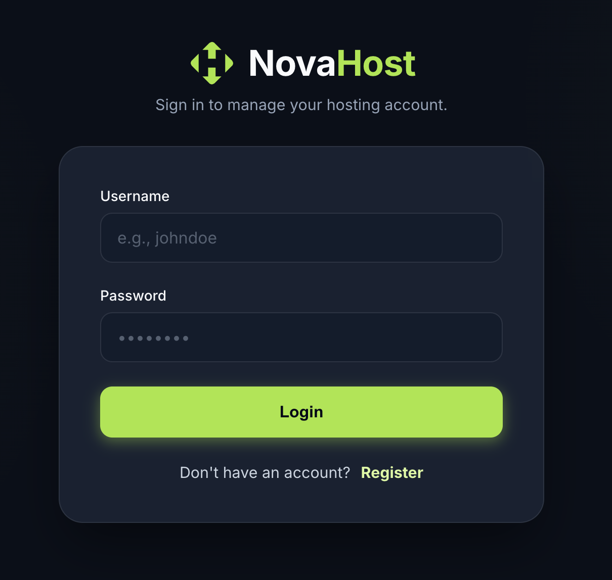
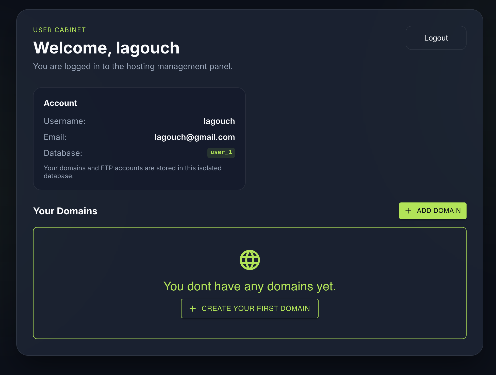
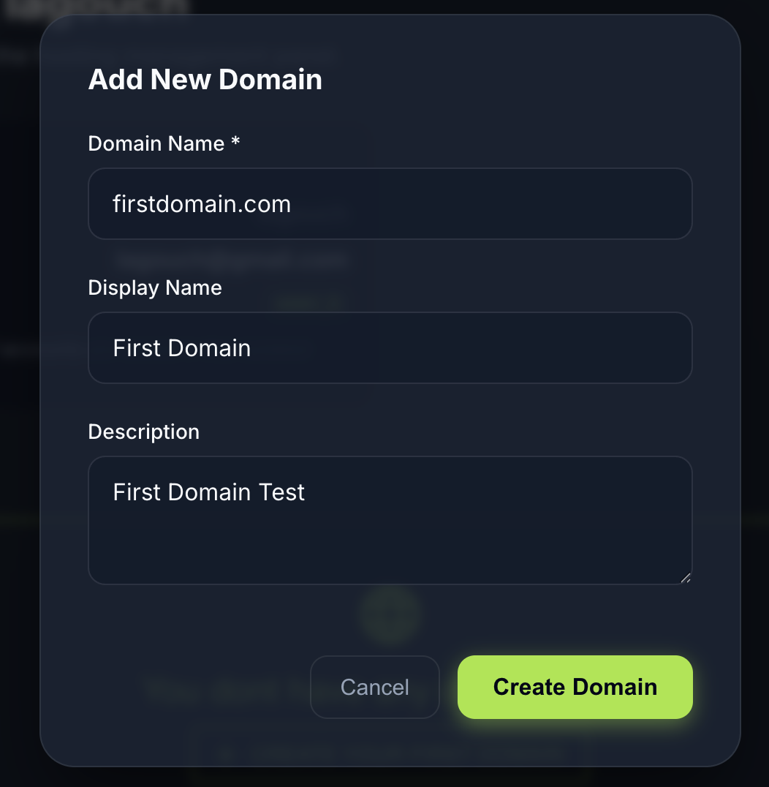
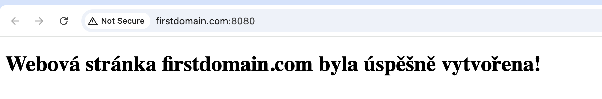
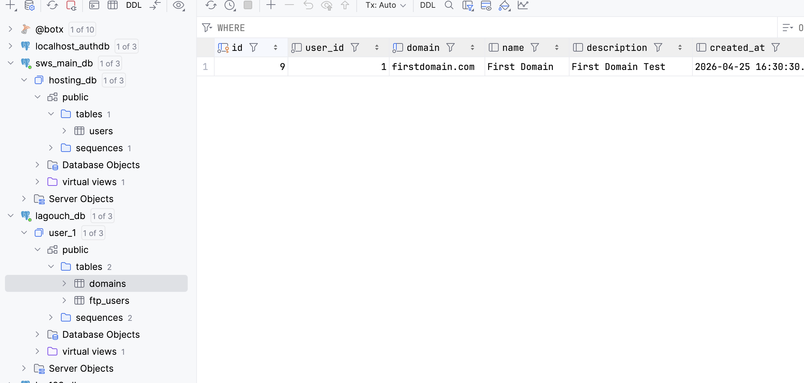
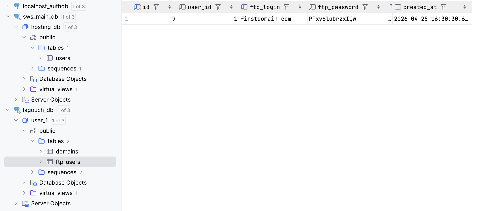

# NovaHost — Hostingové centrum
**Semestrální práce | SWS2026**

**Tým:** Viktoriia Garkusha, Arina Nazhmedenova, Anton Nikolaichuk, Yaroslav Marukhno, Tim Voronkin, Tadeáš Sýkora, Štěpán Adámek

---

## Úvod

NovaHost je lokální hostingové centrum, které simuluje klíčové funkce webhostingové služby. Uživatelé se mohou zaregistrovat, přihlásit a hostovat vlastní domény. Po vytvoření domény získají automaticky FTP přístupové údaje a jejich soubory jsou okamžitě dostupné přes webový prohlížeč.

Každý uživatel má **vlastní izolovanou databázi** — jeho domény a FTP účty jsou odděleny od ostatních uživatelů na úrovni PostgreSQL.

---

## Použité technologie

| Služba | Technologie | Port (host) |
|---|---|---|
| Databáze | PostgreSQL 15 | 5440 |
| Webový server | Apache httpd | 8080 |
| Backend | Node.js / Express | 8765 |
| Frontend | React + Vite | 5274 |
| FTP | Pure-FTPd | 21 |

Celá aplikace běží v Docker kontejnerech orchestrovaných pomocí Docker Compose.

---

## Struktura projektu

```
sws2026/
├── apache/
│   ├── Dockerfile                  # Image pro Apache + povolení vhostů a mod_rewrite
│   └── docker-entrypoint.sh        # Spouští Apache + watcher pro auto-reload
├── apache-config/
│   └── httpd-vhosts.conf           # VirtualHost konfigurace (generována backendem)
├── backend/
│   ├── config/env.js               # Načítání proměnných prostředí
│   ├── db/
│   │   ├── migrations.js           # Migrace hlavní DB při startu
│   │   └── pool.js                 # Správa DB připojení (hlavní + per-user pool cache)
│   ├── middleware/authMiddleware.js # Ověření JWT tokenu
│   ├── routes/
│   │   ├── authRoutes.js           # POST /api/register, POST /api/login
│   │   └── domainRoutes.js         # GET/POST/DELETE /api/domains
│   ├── services/domainService.js   # Práce s vhosts.conf a index.html
│   ├── utils/domainUtils.js        # Validace domén, generování FTP údajů
│   ├── Dockerfile
│   └── server.js                   # Vstupní bod backendu
├── db/
│   ├── init.sql                    # Inicializace hlavní DB (tabulka users)
│   └── migrations/
│       └── 002_pg_user_roles.sql   # PostgreSQL role + Row Level Security
├── frontend/
│   ├── src/
│   │   ├── components/             # UI komponenty (DomainCard, AddDomainDialog, ...)
│   │   ├── hooks/                  # useAuth.js, useDomains.js, useSnackbar.js
│   │   ├── pages/                  # Login.jsx, Register.jsx, Dashboard.jsx
│   │   └── utils/jwt.js            # Dekódování JWT tokenu
│   └── Dockerfile
├── ftp/
│   ├── Dockerfile
│   ├── run.sh                      # Spuštění Pure-FTPd + sync loop
│   └── sync.sh                     # Synchronizace FTP uživatelů z DB
├── hosted-sites/                   # Soubory hostovaných webů (Docker volume)
├── auto-hosts.sh                   # Watcher: auto-přidávání domén do /etc/hosts
├── setup.sh                        # Jednopříkazové spuštění celé aplikace
├── docker-compose.yml
├── .env                            # Lokální konfigurace (není v gitu)
└── .env.example                    # Šablona konfigurace
```

---

## Architektura databáze

Aplikace používá **dvouvrstvou databázovou architekturu**:

```
PostgreSQL cluster
├── hosting_db          ← hlavní DB (správcovská)
│   └── users           ← všechny uživatelské účty + odkaz na jejich DB
│
├── user_lagouch        ← izolovaná DB uživatele "lagouch"
│   ├── domains
│   └── ftp_users
│
└── user_viktor         ← izolovaná DB uživatele "viktor"
    ├── domains
    └── ftp_users
```

### Hlavní databáze `hosting_db`

#### Tabulka `users`

| Sloupec | Typ | Vlastnosti |
|---|---|---|
| id | SERIAL | PRIMARY KEY |
| username | VARCHAR(50) | UNIQUE, NOT NULL |
| email | VARCHAR(190) | UNIQUE, NOT NULL |
| password_hash | VARCHAR(255) | NOT NULL |
| db_name | VARCHAR(64) | UNIQUE — název izolované DB (`user_<username>`) |
| created_at | TIMESTAMP | DEFAULT NOW() |



### Izolovaná databáze uživatele (`user_<username>`)

Při registraci se automaticky vytvoří nová PostgreSQL databáze pojmenovaná `user_<username>`. Tato databáze obsahuje:

#### Tabulka `domains`

| Sloupec | Typ | Vlastnosti |
|---|---|---|
| id | SERIAL | PRIMARY KEY |
| user_id | INTEGER | NOT NULL |
| domain | VARCHAR(190) | UNIQUE, NOT NULL |
| name | VARCHAR(100) | NULL |
| description | TEXT | NULL |
| created_at | TIMESTAMP | DEFAULT NOW() |

#### Tabulka `ftp_users`

| Sloupec | Typ | Vlastnosti |
|---|---|---|
| id | SERIAL | PRIMARY KEY |
| user_id | INTEGER | NOT NULL |
| ftp_login | VARCHAR(64) | UNIQUE, NOT NULL |
| ftp_password | VARCHAR(255) | NOT NULL |
| ftp_dir | VARCHAR(255) | NOT NULL |
| created_at | TIMESTAMP | DEFAULT NOW() |

---

## Spuštění aplikace

### Požadavky
- Docker Desktop
- macOS (pro `setup.sh`) nebo manuální postup na jiných OS

### Jednopříkazové spuštění (macOS)

```bash
./setup.sh
```

Skript provede:
1. Přidání testovacích domén do `/etc/hosts` (vyžaduje sudo)
2. Sestavení a spuštění Docker kontejnerů (`docker compose up --build -d`)
3. Spuštění `auto-hosts.sh` na pozadí — automaticky přidává nové domény do `/etc/hosts` do 3 sekund po jejich vytvoření

### Manuální spuštění

```bash
docker compose up --build -d
```

### Přidání domény do /etc/hosts (manuálně)

**macOS/Linux:**
```bash
echo "127.0.0.1 moje-domena.cz" | sudo tee -a /etc/hosts
```

**Windows:** upravit `C:\Windows\System32\drivers\etc\hosts`

---

## Popis komponent

### Backend

#### `server.js`
Hlavní vstupní bod. Inicializuje Express, nastavuje CORS, registruje routy a při startu spouští databázové migrace.

#### `db/pool.js`
Spravuje PostgreSQL připojení. Obsahuje:
- `mainPool` — připojení k hlavní databázi `hosting_db`
- `getUserPool(dbName)` — pool cache pro izolované databáze uživatelů (max 100, LRU eviction)
- `createUserDatabase(dbName)` — vytvoří novou PostgreSQL databázi a aplikuje schéma (`domains`, `ftp_users`)
- `dropUserDatabase(dbName)` — bezpečně ukončí připojení a smaže databázi

#### `db/migrations.js`
Spouští se při každém startu backendu. Zajišťuje existenci tabulky `users` v hlavní databázi (idempotentní).

#### `routes/authRoutes.js`
- `POST /api/register` — registrace: vytvoří uživatele v `hosting_db`, vytvoří izolovanou databázi `user_<username>`, při chybě provede rollback (smaže uživatele)
- `POST /api/login` — přihlášení: ověří heslo bcryptem, vydá JWT token (platnost 1 hodina) obsahující `id`, `username`, `email`, `db_name`

#### `routes/domainRoutes.js`
- `GET /api/domains` — vrátí seznam domén přihlášeného uživatele včetně FTP údajů
- `POST /api/domains` — vytvoří doménu: DB záznam, FTP účet, adresář, `index.html`, VirtualHost v Apache konfiguraci. Vše v transakci s rollbackem při chybě.
- `DELETE /api/domains/:domain` — smaže doménu, FTP účet, soubory a VirtualHost

#### `services/domainService.js`
- `appendVhostIfMissing(domain)` — přidá VirtualHost blok do `httpd-vhosts.conf`
- `removeVhost(domain)` — odstraní VirtualHost blok z konfigurace
- `writeDefaultIndex(dir, domain)` — vytvoří výchozí `index.html` pro novou doménu

#### `utils/domainUtils.js`
- `normalizeDomain(domain)` — lowercase + trim
- `isValidDomain(domain)` — validace formátu pomocí regex
- `ftpLoginFromDomain(domain)` — převod domény na FTP login (`moje-domena.cz` → `moje_domena_cz`, max 32 znaků)
- `generateFtpPassword()` — generuje náhodné heslo pomocí `crypto.randomBytes`

#### `middleware/authMiddleware.js`
Ověřuje JWT token z hlavičky `Authorization: Bearer <token>`. Při platném tokenu uloží payload do `req.user` (obsahuje `db_name` pro přístup k izolované DB).

---

### Apache

Apache server obsluhuje hostované weby. Pro každou doménu existuje `VirtualHost` blok v `httpd-vhosts.conf`, který mapuje doménu na adresář v `hosted-sites/`.

#### Auto-reload při změně konfigurace

`apache/docker-entrypoint.sh` spouští na pozadí watcher, který každé 3 sekundy kontroluje změny v `httpd-vhosts.conf` pomocí MD5 kontrolního součtu. Při změně spustí `httpd -k graceful` — Apache přenačte konfiguraci bez přerušení aktivních připojení.

```
hosted-sites/
├── mojefirma.cz/
│   └── index.html
└── test1.cz/
    └── index.html
```

Ukázka generovaného VirtualHost bloku:
```apache
# AUTO-GENERATED: mojefirma.cz
<VirtualHost *:80>
    ServerName mojefirma.cz
    DocumentRoot /usr/local/apache2/htdocs/mojefirma.cz
    <Directory /usr/local/apache2/htdocs/mojefirma.cz>
        Options Indexes FollowSymLinks
        AllowOverride All
        Require all granted
    </Directory>
</VirtualHost>
```

---

### FTP server

Pure-FTPd poskytuje FTP přístup k souborům hostovaných webů. Každá doména má vlastní FTP účet s unikátními přihlašovacími údaji.

#### `ftp/run.sh`
Spustí Pure-FTPd s virtual user autentizací. Na pozadí každých **5 sekund** spouští `sync.sh`.

#### `ftp/sync.sh`
Synchronizuje FTP uživatele z databáze do Pure-FTPd:
1. Načte seznam všech uživatelských databází z `hosting_db`
2. Pro každou databázi načte záznamy z `ftp_users`
3. Vytvoří nebo aktualizuje virtuální FTP uživatele v Pure-FTPd

#### Připojení přes FileZilla

| Pole | Hodnota |
|---|---|
| Host | `127.0.0.1` |
| Port | `21` |
| Protokol | FTP — File Transfer Protocol |
| Šifrování | **Pouze prosté FTP (nezabezpečeno)** |
| Typ přihlášení | Normální |
| Uživatel / Heslo | z dashboardu (FTP ▼) |

> **Důležité:** v záložce Transfer → Transfer Type nastavit **Binary** (ne ASCII).





---

### Frontend

Uživatelské rozhraní napsané v Reactu (Vite).

#### Stránky
- `Register.jsx` — registrační formulář
- `Login.jsx` — přihlašovací formulář, po úspěchu uloží JWT do `localStorage`
- `Dashboard.jsx` — správa domén; zobrazuje username, email, **název izolované databáze** a seznam domén s FTP údaji















#### Hooky
- `useAuth.js` — přístup k JWT tokenu, autentizované `fetch` požadavky, logout
- `useDomains.js` — načítání, přidávání a mazání domén přes API

---

## Připojení k databázi (DataGrip / DBeaver)

Pro administrátorský přístup k databázím:

| Pole | Hodnota |
|---|---|
| Host | `localhost` |
| Port | `5440` |
| User | `root` |
| Password | `rootpassword` |

Přepínáním pole **Database** přistupujete k různým databázím:
- `hosting_db` → tabulka `users` se všemi účty a jejich `db_name`
- `user_lagouch` → tabulky `domains` a `ftp_users` konkrétního uživatele

---

## Bezpečnost

| Oblast | Řešení |
|---|---|
| Hesla uživatelů | bcrypt (cost factor 12) |
| Autentizace | JWT (HS256, platnost 1h) |
| SQL injection | Parametrizované dotazy (`$1`, `$2`) |
| Path traversal | Kontrola `clientDir.startsWith(SITES_ROOT)` |
| Izolace dat | Každý uživatel má vlastní PostgreSQL databázi |
| FTP izolace | Každá doména má unikátní FTP login s přístupem pouze ke svému adresáři |
